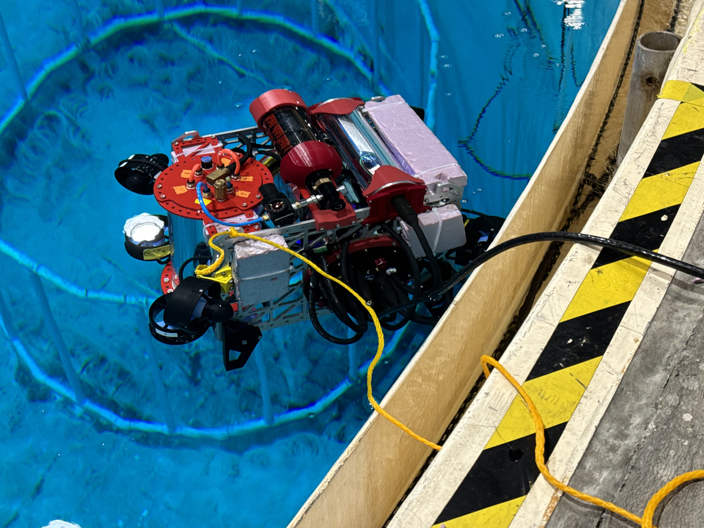

# Towards a 6-DoF Dynamics Model for Qubo

## Summary

## Picture of Qubo in the Water 

## Defining Frames of Reference
### Defining the World Frame of Reference 
I define the world reference frame as $\{ \mathcal{W} \}$. This reference frame neither translates nor rotates. 

### Defining the Body-Fixed Frame of Reference
I define Qubo's body-fixed reference frame as $\{ \mathcal{B} \}$. This reference frame moves with Qubo and originates at Qubo's center of mass (CoM).

## Describing Rotations Between Frames 
I describe rotations between reference frames using rotation matrices, parameterized by Euler angles, and define the overall rotation from body-frame coordinates to world-frame coordinates as 

$$
\mathbf{R} = \mathbf{R}_x(\phi) \mathbf{R}_y(\theta) \mathbf{R}_z(\psi).
$$

with

$$
\mathbf{R}_x(\phi) = \begin{bmatrix}
1 & 0 & 0 \\
0 & \cos\phi & -\sin\phi \\
0 & \sin\phi & \cos\phi
\end{bmatrix},
$$

$$
\mathbf{R}_y(\theta) = \begin{bmatrix}
\cos\theta & 0 & \sin\theta \\
0 & 1 & 0 \\
-\sin\theta & 0 & \cos\theta
\end{bmatrix},
$$

$$
\mathbf{R}_z(\psi) = \begin{bmatrix}
\cos\psi & -\sin\psi & 0 \\
\sin\psi & \cos\psi & 0 \\
0 & 0 & 1
\end{bmatrix}.
$$

Here, $\phi$, $\theta$, and $\psi$ denote rotations about the body-frame $x$, $y$, and $z$ axes, respectively.

## Defining the Degrees of Freedom
I indicate that Qubo has six degrees of freedom—three translational and three rotational—and write these as a set of independent coordinates:

$$
\mathbf{DoF} = \lbrace x, y, z, \phi, \theta, \psi \rbrace.
$$

## Defining the State Vector
I define Qubo's state vector as

$$

\begin{equation}
    \mathbf{s} = 
    \begin{bmatrix}
    \mathbf{x} \\
    \mathbf{\Theta} \\
    \mathbf{v} \\
    \mathbf{\omega}
    \end{bmatrix}
    =
    \begin{bmatrix}
    x \\ y \\ z \\
    \phi \\ \theta \\ \psi \\
    \dot{x} \\ \dot{y} \\ \dot{z} \\
    p \\ q \\ r
    \end{bmatrix}
\end{equation}

$$

where $\mathbf{x}$ represents the linear position, $\mathbf{\Theta}$ the Euler angles, $\mathbf{v}$ the linear velocity, and $\mathbf{\omega}$ the body rates.

## Defining the Relationship Between Body Rates and Euler Rates 
I establish that the transformation between 

## Modeling the Displacement from the Center of Mass (CoM) to the Center of Buoyancy (CoB)
I model the displacement vector from Qubo's center of mass (CoM) to its center of buoyancy (CoB) as

$$
\mathbf{r}_b = \mathbf{r}_{\text{CoB}} - \mathbf{r}_{\text{CoM}},
$$

where $\mathbf{r}_{\text{CoM}}$ and $\mathbf{r}_{\text{CoB}}$ denote the coordinates of Qubo's center of mass and center of buoyancy, respectively.

## Modeling the External Forces and Moments

### Modeling the Thruster Actuation Forces and Actuation Moments
I model the force produced by each of Qubo's thrusters as comprising a thrust magnitude and a unit direction. 

$$
\mathbf{u}_i = u_i \, \hat{\mathbf{e}}_{u_i}.
$$

It follows from this definition that the combined thrust actuation force can be expressed as 

$$
\mathbf{u} = \sum_{i=1}^{8} \mathbf{u}_i = \sum_{i=1}^{8} u_i \, \hat{\mathbf{e}}_{u_i}.
$$

Furthermore, the combined thrust actuation moment, about Qubo's center of mass (CoM) can be expressed as 

$$
\mathbf{M}_u = \sum_{i=1}^{8} \mathbf{r}_b \times \mathbf{u}_i = \sum_{i=1}^{8} \mathbf{r}_b \times \left( u_i \, \hat{\mathbf{e}}_{u_i} \right).
$$

## Modeling The Body Forces and Body Moments

### Modeling the Hydrodynamic Drag Forces and Moments
I model the hydrodynamic drag as damping forces and moments acting on Qubo's translational and rotational degrees of freedom, respectively:

$$
\mathbf{F}_d = -\mathbf{C}_x\,\dot{\mathbf{x}},
$$

$$
\mathbf{M}_d = -\mathbf{C}_\omega\,\mathbf{\omega},
$$

where

$$
\mathbf{C}_x = \begin{bmatrix}
c_x & 0 & 0 \\
0 & c_y & 0 \\
0 & 0 & c_z
\end{bmatrix}
\quad \text{and} \quad
\mathbf{C}_\omega = \begin{bmatrix}
c_\phi & 0 & 0 \\
0 & c_\theta & 0 \\
0 & 0 & c_\psi
\end{bmatrix}.
$$

### Modeling the Gravity Force 
I model the gravity force as

$$
\mathbf{F}_g = F_g \begin{bmatrix} 0 \\ 0 \\ -1 \end{bmatrix},
$$

where $F_g$ is the magnitude of the gravitational force. The gravity force acts in the negative $z$ world-frame direction and is applied at Qubo's center of mass (CoM).

### Modeling the Buoyancy Force and Buoyancy Moment
I model the buoyancy force and moment as

$$
\mathbf{F}_b = F_b \begin{bmatrix} 0 \\ 0 \\ 1 \end{bmatrix},
$$

and

$$
\mathbf{M}_b = \mathbf{r}_b \times \mathbf{F}_b = \mathbf{r}_b \times \left( F_b \begin{bmatrix} 0 \\ 0 \\ 1 \end{bmatrix} \right),
$$

where $F_b$ is the magnitude of the buoyancy force. The buoyancy force acts in the positive $z$ world-frame direction and is applied at Qubo's center of buoyancy (CoB); the resulting moment is computed about Qubo's center of mass (CoM).

## Formulating the Rigid-Body Dynamics

### Formulating the Linear Rigid-Body Dynamics
I formulate the linear dynamics by employing Newton's second law:

$$
\mathbf{u} + \mathbf{F}_g + \mathbf{F}_b + \mathbf{F}_d = m\,\ddot{\mathbf{x}}.
$$

It follows that the linear accelerations are

$$
\ddot{\mathbf{x}} = \frac{1}{m}\left( \mathbf{u} + \mathbf{F}_g + \mathbf{F}_b + \mathbf{F}_d \right).
$$

### Formulating the Rotational Rigid-Body Dynamics
I formulate the rotational dynamics by employing Euler's equation for rigid-body motion. Since Euler's equation is formulated in the body frame, the buoyancy moment must be rotated into the body frame using the transpose of the rotation matrix:

$$
\mathbf{R}^T \mathbf{M}_b + \mathbf{M}_u + \mathbf{M}_d = \mathbf{I}\,\dot{\mathbf{\omega}} + \mathbf{\omega} \times \left( \mathbf{I}\,\mathbf{\omega} \right),
$$

with $\mathbf{I}$ being the inertia matrix and $\dot{\mathbf{\omega}}$ representing the body-frame angular acceleration.

Solving for the body-frame angular accelerations, I obtain

$$
\dot{\mathbf{\omega}} = \mathbf{I}^{-1}\left( \mathbf{R}^T \mathbf{M}_b + \mathbf{M}_u + \mathbf{M}_d - \mathbf{\omega} \times \left( \mathbf{I}\,\mathbf{\omega} \right) \right).
$$

## Assembling the State-Space Model 

$$
\dot{\mathbf{s}} = \begin{bmatrix}
\dot{\mathbf{x}} \\
\dot{\mathbf{\Theta}} \\
\ddot{\mathbf{x}} \\
\dot{\mathbf{\omega}}
\end{bmatrix}
=
\begin{bmatrix}
\mathbf{v} \\
\mathbf{T}(\mathbf{\Theta})\,\mathbf{\omega} \\
\frac{1}{m}\left( \mathbf{u} + \mathbf{F}_g + \mathbf{F}_b + \mathbf{F}_d \right) \\
\mathbf{I}^{-1}\left( \mathbf{R}^T \mathbf{M}_b + \mathbf{M}_u + \mathbf{M}_d - \mathbf{\omega} \times \left( \mathbf{I}\,\mathbf{\omega} \right) \right)
\end{bmatrix}.
$$

## MATLAB Simulation
### Defining the Desired Simulation Output
### Defining the Simulation Input Parameters
### Implementing the State Equations as a Function 
### Verifying The Functionality of the Simulation

## Insights from the Process
### On the Relative Positioning of Qubo’s Center of Mass (CoM) and Center of Buoyancy (CoB)
Qubo's Center of Mass (CoM) should be positioned below Qubo's Center of Buoyancy (CoB). 
If Qubo's CoM is positioned below Qubo's CoB, then, when Qubo is rotationally displaced in any of its three rotational degrees of freedom (DoF), the buoyancy force will function as a restoring force, acting to drive Qubo back to a level position. 
If Qubo's CoM and CoB are coincident, no such restoring force would be generated. In this case, Qubo would be dependent on its thrusters to return to a level orientation or on other external forces to return to a level orientation. 
If Qubo's CoM is positioned above Qubo's CoB, then if Qubo is rotationally displaced in any of its three rotational degrees of freedom (DoF), then the moment generated about the CoM would act to increase the displacement. If this resulting moment is not sufficiently offset by Qubo's thrustors or by other external forces from Qubo's surrounding environment, Qubo could turn upside-down. 
We should design Qubo to achieve passive hydrostatic stability. If Qubo is passively hydrostatically stable, then Qubo's actuators would not need to work as hard to maintain Qubo's orientation. 
That being said, if Qubo's mission involves mainly agile maneuvering, then it may be logical to diminish the degree of Qubo's passive hydrostatic stability, which would be possible by adjusting the relative positioning of Qubo's CoM and CoB.
So, to what extent does Qubo's mission involve agile maneuvering? 
Qubo's Center of Mass (CoM) and Center of Buoyancy (CoB) should be vertically aligned or close to being vertically aligned.
Only if Qubo's CoM and CoB are vertically aligned about an axis perpendicular to Qubo's bottom face will the buoyant force not produce any moment about Qubo's CoM when Qubo is in a level orientation. 
The underlying assumption here is that we should design Qubo so that Qubo is hydrostatically passively stable.
But for the buoyant force to produce a moment when Qubo is in a level orientation is not necessarily undesirable.
Also, for any such moment to produce a rotation requires the overcoming of resistive forces from the surrounding water. Thus, even if such a moment exists when Qubo is in a level orientation, this does not imply that Qubo will rotate even a small amount.
So, what's more important to us, ability to perform agile maneuvers or ability to self-correct when perturbed from a level orientation? 
Qubo's Center of Mass (CoM) and Center of Buoyancy (CoB) should be relatively close together but should not be coincident.
The moment generated by the buoyant force about Qubo's CoM depends entirely on the cross product of the displacement vector from Qubo's CoM to Qubo's CoB and on the magnitude of the buoyant force, which is a function of Qubo's geometry. For Qubo to be hydrostatically passively stable, Qubo's must be positioned above Qubo's CoM, but not so far away as to render Qubo overly stiff with respect to its rotational degrees of freedom. However, if the CoM and CoB are coincident, then the buoyant force will not generate a restoring torque, meaning Qubo would need to rely on its thrusters or other means to restore itself to level orientation.
That being said, for Qubo to not be hydrostatic passive stable may not necessarily be undesirable. 
On the Consequences of a Non-Symmetric Mass Distribution for Maneuverability and Control

